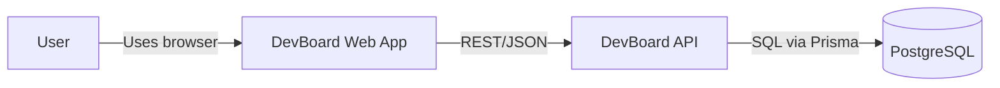

# C4 Level 1 - System Context

```mermaid
flowchart LR
  User[User] -->|Uses browser| DevBoard[DevBoard Web App]
  DevBoard -->|REST/JSON| API[DevBoard API]
  API -->|SQL via Prisma| DB[(PostgreSQL)]
```

Users interact with DevBoard through a browser. The web app talks to the API, which persists data in PostgreSQL.
