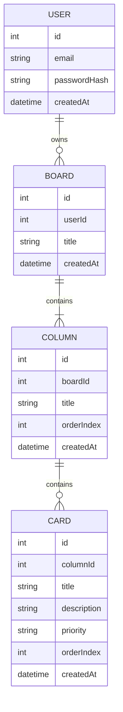
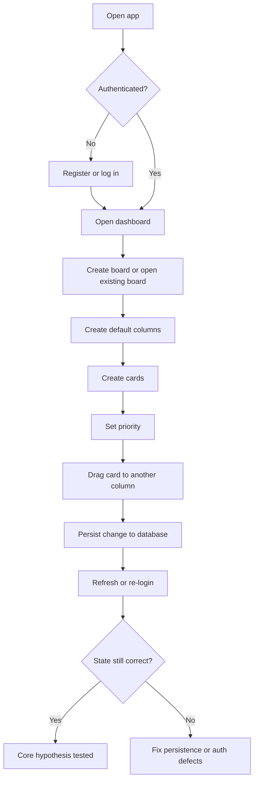

# DevBoard Assignment 4 report blueprint

## Executive summary

This report is a working blueprint for writing the Assignment 4 submission **and** for guiding the AI coding agent that will finish the MVP. The central decision is to treat DevBoard as a **lightweight Kanban product for a narrow user segment**, not as a smaller clone of a large project-management suite. The uploaded course brief requires a falsifiable MVP hypothesis, a PMF signal, product-debt awareness, ethics/privacy decisions, a working prototype, and a hypothesis test report; the earlier DevBoard assignments already frame the product around user authentication, boards, columns, cards, drag-and-drop, priority, persistence, and user-specific data isolation. That means the highest-scoring path is not “add more features,” but “finish one secure, stable, end-to-end workflow and explain exactly what it proves.” In Lean Startup terms, the goal is validated learning through the smallest credible build–measure–learn loop, not a feature-complete backlog (Ries, 2011). fileciteturn0file0 fileciteturn0file1 fileciteturn0file2 fileciteturn0file3 citeturn4view0turn4view1

## MVP hypothesis

An Assignment 4 report should define the MVP from the **user’s problem** backward, not from the codebase forward. The uploaded DevBoard materials consistently describe a narrow value proposition: users who only need lightweight visual task flow are slowed down by heavier, more complex tools. That is exactly the kind of situation where the MVP should test the riskiest value assumption first rather than attempt broad product completeness. In Lean Startup language, the MVP exists to start learning quickly and to support actionable measurement, not to serve as a “simple version of the whole product” (Ries, 2011). fileciteturn0file1 fileciteturn0file3 citeturn4view0turn4view1

### Recommended hypothesis definition

| Field | Recommended report text |
|---|---|
| Problem | “When I only need to capture, prioritise, and move work through a few stages, existing tools feel overloaded and slow me down.” |
| Riskiest assumption | The target user values **speed, clarity, and low setup effort** more than advanced team/process features. |
| MVP hypothesis | “If we build a fast, low-setup Kanban board where a user can register, create a board, add columns and cards, assign priority, move cards between stages, and see changes persist, we believe students, freelancers, solo developers, and very small teams will use it repeatedly, because simple visual flow matters more to them than enterprise complexity.” |
| Minimum test | A working prototype with real input, real state changes, persistence after refresh, and user-specific access control. |
| Failure condition | Users understand the idea but do not perceive enough benefit over existing tools, or the core flow takes too long / feels too fragile to trust. |

### Explicit MVP scope and non-scope

| In scope | Why it belongs in the MVP |
|---|---|
| Register / login | Required to test personal, persistent task management rather than a static demo |
| Dashboard with boards | Lets users create a meaningful workspace |
| Board page with columns and cards | Core environment where value is delivered |
| Card create, edit, delete | Basic task capture and maintenance |
| Priority on cards | Tests whether lightweight prioritisation is enough for the target user |
| Drag-and-drop between columns | Core proof of visual workflow value |
| Persistence after refresh / re-login | Converts UI interaction into trusted product behaviour |
| Per-user data isolation | Essential for a credible product, not optional polish |

| Out of scope | Why it should stay out |
|---|---|
| Comments, activity feeds, mentions | Do not test the riskiest assumption |
| File attachments | Extra storage and UI complexity without validating core value |
| Notifications / reminders | Secondary behaviour, not first-run value |
| Team invitations / role systems | High scope cost; weak relevance to solo-first validation |
| Analytics dashboards / reporting | Adds admin surface instead of user value |
| Calendar / timeline / roadmap views | Alternative views before the board workflow is proven |
| Real-time collaboration | Expensive implementation path for the wrong hypothesis |
| Payments / subscriptions | Monetisation is not the current risk being tested |

The strongest report language here is blunt: **DevBoard is not trying to prove that it can do more than existing tools; it is trying to prove that it can do less, more clearly, and with less setup friction.** That is the product hypothesis. fileciteturn0file1 fileciteturn0file2 fileciteturn0file3 citeturn4view0turn4view1

## PMF signal and distribution risk

A weak PMF section says “students” or “everyone” and then tracks signups. A strong PMF section defines a narrow primary user and a behaviour that shows repeated value. The best primary user for DevBoard is not “all students” or “all teams”; it is a person who actively manages a small personal workflow, has 5–30 active tasks, and does **not** need enterprise coordination features. That aligns with the prior DevBoard positioning around simplicity, clarity, and low setup effort. fileciteturn0file1 fileciteturn0file3

### Recommended PMF signal

| Element | Recommended choice |
|---|---|
| Primary user | A university student, freelancer, or solo builder managing one active project with a small number of moving tasks |
| Activation signal | Creates a board and records at least 3 cards within 3 minutes, without help |
| Retention / engagement signal | Returns within 7 days and performs at least 3 meaningful actions on an existing board: create, edit, move, or complete cards |
| Why this is better than signups | It measures repeated workflow value, not curiosity |

This is closer to an actionable metric than a vanity metric because it ties user behaviour to the actual hypothesis: the board is valuable if people return to update work, not merely if they create an account (Ries, 2011). citeturn4view0turn4view1

### Distribution and competition risks

The distribution threat is serious because the core DevBoard workflow already overlaps with current products from **entity["company","Trello","task management software"]**, **entity["company","Atlassian","software company"]** Jira, **entity["company","GitHub","developer platform"]** Projects, **entity["company","Notion","productivity software"]** Projects, and **entity["company","Linear","product development software"]**. Their official pages already present boards, project tracking, Kanban-style flows, or lightweight planning surfaces to users who are one click away from using them. citeturn13view0turn14view0turn4view6turn4view8turn4view9

| Competitor / platform | Overlap with DevBoard | Why this is dangerous | What DevBoard must win on |
|---|---|---|---|
| Trello | Boards, lists, cards, drag/drop | Direct overlap in the simplest board use case | Lower cognitive load and cleaner first-run experience |
| Atlassian Jira | Boards, columns, workflows, prioritised work items | Strong distribution, default boards, adjacent team workflows | Simplicity for users who reject process-heavy tools |
| GitHub Projects | Planning/tracking work in a developer-native environment | Strong home-field advantage for solo developers | Better clarity for users who do not want work management inside code tooling |
| Notion Projects | Projects/tasks shown as Kanban boards alongside docs | Powerful bundling with notes/docs/workspace | Faster setup and less configuration burden |
| Linear | Speed-focused planning and tracking | Strong modern-product positioning and “speed” narrative | Extreme simplicity for smaller personal workflows |

The honest risk analysis is this: **if DevBoard is only “board + cards,” it loses.** It survives only if the report and the product both argue that it is materially faster to start, easier to understand, and less mentally noisy for small personal workflows than incumbents built for larger operating systems of work. citeturn13view0turn14view0turn4view6turn4view7turn4view8turn4view9

## Product debt

The uploaded planning documents already identified the real dangers: Jira-like feature bloat, drag-and-drop state defects, and cross-user authorization failures. Assignment 4 wants those risks reframed specifically as **product debt**, meaning bad decisions about what to build or optimise, not just code shortcuts. That is the right lens, because a lightweight product usually dies from scope confusion before it dies from architecture. fileciteturn0file2

| Product debt risk | How it could appear in DevBoard | Prevention rule for the report and MVP |
|---|---|---|
| Feature creep | Adding comments, attachments, labels, reminders, templates, sharing, analytics, or calendar views before the core workflow is reliable | Freeze the MVP to auth + board + columns + cards + priority + drag/drop + persistence + isolation |
| Wrong early-adopter assumption | Testing only with classmates who already understand Kanban, then assuming freelancers or solo developers will behave the same way | Separate findings by user type and explicitly admit the sample bias in the hypothesis test report |
| North-star misalignment | Optimising for number of boards or cards created instead of task movement, repeat use, and workflow trust | Track return behaviour on an existing board, not raw object creation |

The key point to state in the report is that DevBoard’s most likely product debt is **trying to imitate incumbents badly instead of outperforming them narrowly**. That sentence is sharper and more believable than a generic “we will avoid scope creep.” fileciteturn0file2 citeturn13view0turn14view0turn4view7turn4view9

## Ethics and privacy decisions

Privacy and ethics should be written as product architecture, not as moral decoration. GDPR Article 5 grounds data minimisation and purpose limitation; Article 25 requires protection by design and by default; the entity["organization","European Commission","eu executive arm"] explains that “by default” means only necessary data, limited storage, and limited accessibility; and Article 17 creates a right to erasure. In parallel, entity["organization","IEEE","engineering standards body"]’s Ethically Aligned Design treats well-being, accountability, transparency, and misuse mitigation as design obligations rather than afterthoughts (EU, 2016; European Commission, n.d.; IEEE, 2019). citeturn8search2turn7search3turn9view3turn4view2turn4view3

### Privacy by design decisions

| Principle | Concrete DevBoard decision |
|---|---|
| Data minimisation | Collect only what is required for account creation and task management: email, password hash, boards, columns, cards, and card priority. Do **not** collect profile photos, phone numbers, location, social graph, or behavioural analytics by default. |
| Purpose limitation | Board and card data exists to help the user manage tasks, not to profile productivity, sell ads, or rank users. |
| Default privacy | Boards are private by default. No public links or team sharing in the MVP unless explicitly added and clearly consented to. |
| Right to erasure | Support deletion of user-owned app data and specify the retention policy for logs and backups. If backups cannot be user-level purged, state the limitation honestly and keep retention short. |
| Authorization / IDOR protection | Never fetch boards, columns, or cards by raw ID alone; always scope queries through the authenticated user and the parent resource. |

The practical design implication is simple: if the code or deployment story cannot support privacy-friendly defaults, then the MVP should collect less and expose less. That is a stronger submission than claiming compliance that the prototype cannot actually demonstrate. citeturn8search2turn7search1turn7search3turn9view3

### Ethical risks and mitigations

The most concrete security/privacy risk in DevBoard is not an abstract “hack”; it is broken object-level authorization. entity["organization","OWASP","web security nonprofit"] defines IDOR as an access-control flaw where exposing object references without proper authorization lets one user access another user’s records. For a Kanban app, that would mean reading or modifying another person’s boards, columns, or cards by changing an ID in a URL or request body. citeturn12search0turn12search1turn12search2

| Ethical risk | Why it matters | Who is affected | Mitigation |
|---|---|---|---|
| Private task exposure through IDOR / broken ownership checks | A task board can reveal deadlines, project ideas, exams, work plans, or personal productivity patterns | Any registered user whose board data becomes accessible to another account | Owner-scoped queries, auth middleware, negative multi-user tests, no passwordHash in responses, 403/404 on unauthorized access |
| Covert productivity surveillance in future team features | A lightweight tool can quietly become a monitoring tool if it starts scoring activity or exposing invisible audit patterns | Students, junior workers, freelancers, and small-team members | Keep the MVP free of hidden activity scoring, manager analytics, or silent observation features; if collaboration is added later, make all visibility rules explicit and user-facing |

For the report, that second risk is especially useful because it shows ethical imagination. It says the team understands not only security failure, but also **misuse drift**—the way seemingly helpful workflow data can turn into coercive monitoring if the product direction changes (IEEE, 2019). citeturn4view2turn4view3

## Hypothesis test plan

The hypothesis test report should not read like a victory lap. It should read like an experiment. Lean Startup’s emphasis on validated learning implies that the post-build question is not “does the app exist?” but “what did this build teach us that we could not honestly claim before?” (Ries, 2011). For Assignment 4, a small 3–5 user test is enough to expose whether the workflow is understandable, trustworthy, and worth reusing; it is **not** enough to claim PMF. citeturn4view0turn4view1

### Task script for a 3–5 user test

Give each participant the same script:

1. Register a new account.
2. Log in.
3. Create a board for a real current project or class.
4. Create or accept columns such as To Do, In Progress, Done.
5. Add three real tasks.
6. Assign priority to one task.
7. Move one task to another column.
8. Refresh the page.
9. Confirm the moved task stayed in the new column.
10. Log out and back in.
11. Confirm the board still exists and is correct.

### Metrics to capture

| Metric | Recommended threshold | Why it matters |
|---|---|---|
| Completion without help | 4 of 5 users | Measures learnability |
| Time to first usable board | Under 3 minutes | Measures setup friction |
| Major confusion points | No more than 1 per user | Measures UI clarity |
| Persistence trust | 100% after refresh in test | Measures product credibility |
| Revisit / reuse intention | At least 2 of 5 return within 48 hours or say they would replace current lightweight method | Measures early behavioural value |

### Sample results template

| User | Segment | Completed without help | Time to first board | Major confusion | Refresh preserved state | Re-login preserved state | Would use again / returned | Key note |
|---|---|---:|---:|---|---|---|---|---|
| U1 | Student | Yes | 2m 10s | None | Yes | Yes | Yes | “Fast enough for class tasks.” |
| U2 | Freelancer | Yes | 2m 45s | Card edit not obvious | Yes | Yes | Maybe | Wanted simpler default columns |
| U3 | Solo developer | No | 4m 20s | Unsure where to create card | Yes | Yes | No | Preferred GitHub workflow |
| U4 | Student | Yes | 1m 55s | None | Yes | Yes | Yes | Liked drag/drop clarity |
| U5 | Small-team user | Yes | 3m 05s | Wanted sharing | Yes | Yes | Maybe | MVP okay but collaboration missing |

### Interpretation rule

Use a hard interpretation rule in the report:

- **Supported enough to continue** if most users complete the flow unaided, board state remains trustworthy, and at least some users express repeat-use intent.
- **Not supported yet** if users struggle to understand the core board flow or do not perceive a speed/clarity advantage.
- **Next action if weak**: simplify the existing flow first. Do **not** jump to more features.

That framing is important because it turns the hypothesis test report into decision evidence rather than self-congratulation. citeturn4view0turn4view1

## Implementation checklist for the AI agent

This section should be passed to the coding agent almost verbatim. It assumes only the broad architecture described in the uploaded DevBoard assignments; if the actual repository differs, the agent should preserve the working stack and choose the smallest safe path to a stable MVP instead of forcing a rewrite. fileciteturn0file1 fileciteturn0file2 fileciteturn0file3

### Core architecture model

The diagrams below express the **minimum conceptual model** the agent should preserve.

These models are consistent with the earlier DevBoard materials: user-owned boards, ordered columns, ordered cards, authenticated access, and drag-and-drop persistence as the centre of the product. fileciteturn0file1 fileciteturn0file3

### Prioritised build order

| Priority | Area | Required work | Exact acceptance criterion |
|---|---|---|---|
| P0 | Authentication | Register, login, token/session handling, protected routes | New user can register, log in, refresh, and remain authenticated if token/session is valid |
| P0 | Ownership checks | Scope every board/column/card read and write to authenticated user | User B cannot fetch, edit, move, or delete User A’s records |
| P0 | Board loading | Dashboard lists boards; board page loads columns and cards from database | Real user data renders with no fake buttons |
| P0 | Card CRUD | Create, edit, delete card with visible UI feedback | User can manage at least 3 cards end-to-end |
| P0 | Persistence | Refresh and re-login preserve board state | Board content and card positions remain correct |
| P1 | Drag-and-drop | Move cards between columns; optionally reorder within column | A moved card stays in the target column after refresh |
| P1 | Ordering logic | Keep orderIndex stable and collision-free enough for demo | No duplicated or corrupted visible order after repeated moves |
| P1 | Error / empty states | Clear messages for loading, failure, no boards, no cards | First-time user understands what to do next |
| P2 | Docs | README, .env.example, setup steps, local run instructions | Another person can run the project from README |
| P2 | Demo polish | Clean labels, visible priority, stable navigation | Demo can be shown in one uninterrupted flow |

### Detailed implementation rules

**Backend**
- Keep authentication reliable and minimal.
- Hash passwords before storage.
- Protect private routes consistently.
- Never trust client-provided ownership.
- Return clear JSON errors.
- Use transactions for card move / reorder logic if the stack supports them safely.
- Add negative cross-user tests or at least documented manual tests.

**Database**
- Preserve the `User → Board → Column → Card` hierarchy.
- Add `orderIndex` or equivalent if card/column ordering requires it.
- Avoid destructive schema rewrites unless the current schema blocks the MVP.
- Seed data is optional; it should not substitute for real CRUD flow.

**Frontend**
- Minimum screens: auth, dashboard, board.
- Board screen must support create card, visible priority, drag/drop, and persistence.
- Default columns are acceptable and often preferable for a cleaner MVP.
- If optimistic updates are unstable, switch to safer refetch-after-mutation behaviour.

**Drag-and-drop**
- Moving across columns matters more than perfect reordering.
- If full reorder logic is fragile, stabilise inter-column movement first.
- The application must never show a move as successful if the backend rejected it.

**Security**
- No plaintext passwords.
- No password hashes in responses.
- No unauthenticated board/card access.
- No ID-only object lookup without ownership checks.
- Use environment variables for secrets.

**Documentation**
- README must explain install, env variables, database setup, run commands, and demo flow.
- If deployment exists, document it; if not, provide reliable local instructions.
- Be explicit about what remains unimplemented.

### Manual acceptance checklist and demo steps

The coding agent should stop adding features and evaluate the build against this checklist:

1. Register a new user.
2. Log in.
3. Create a board.
4. Open the board.
5. Create or load columns such as To Do, In Progress, Done.
6. Create at least 3 cards.
7. Assign priority to one card.
8. Move one card to another column.
9. Refresh the page.
10. Confirm board state is unchanged and correct.
11. Log out and log back in.
12. Confirm the board still exists.
13. Create a second account.
14. Confirm the second account cannot access the first account’s data.

If any item above fails, the MVP is not finished, regardless of how many extra features exist. That is the right standard for Assignment 4. fileciteturn0file0 citeturn12search0turn12search2

## Reading connection and appendix

### Reading connection

The most defensible reading connection is **entity["book","The Lean Startup","eric ries 2011"]** by entity["people","Eric Ries","lean startup author"]**.** The concrete product decision it supports is this: **DevBoard should intentionally exclude comments, file attachments, reminders, analytics, invitations, and other expansion features until the team proves that users actually value a fast, low-setup board workflow.** That decision directly reflects Lean Startup’s build–measure–learn loop and its framing of the MVP as the fastest path to validated learning, not to product breadth (Ries, 2011). In the report, state clearly that default columns, lightweight card editing, persistence, and user isolation were prioritised because they test the riskiest assumption sooner than any collaboration or reporting features would. citeturn4view0turn4view1

### Appendix

#### Exact deliverables to submit

| Deliverable | What it should contain |
|---|---|
| Written report | Executive summary, MVP hypothesis, PMF signal, product debt, ethics/privacy decisions, hypothesis test report, reading connection, references |
| Prototype | Working code or live link that demonstrates the core end-to-end workflow |
| README | Setup instructions, environment variables, database setup, run commands, and demo steps |

That submission shape is driven by the uploaded Assignment 4 brief; the report should stay inside the 4–6 page target by prioritising expository paragraphs, compact tables, and small diagrams rather than long narrative filler. fileciteturn0file0

#### README checklist

- Project description and target user
- Tech stack actually used in the repo
- Prerequisites
- `.env.example`
- Install commands
- Database / migration commands
- Frontend run command
- Backend run command
- Build command
- Manual demo flow
- Known limitations
- If applicable, test account or seed instructions

#### Suggested git commit messages

- `feat(auth): harden register and login flow`
- `feat(boards): add user-scoped board dashboard`
- `feat(columns): create default board columns`
- `feat(cards): implement card CRUD with priority`
- `feat(dnd): persist card movement across columns`
- `fix(security): scope board and card queries by owner`
- `fix(ui): add empty and error states for dashboard and board`
- `docs(readme): add setup, env, and demo instructions`
- `test(manual): document multi-user acceptance checklist`

### References

Ries, E. (2011). *The Lean Startup*. Crown Business. Supported by official Lean Startup materials. citeturn4view0turn4view1

Regulation (EU) 2016/679 of the European Parliament and of the Council of 27 April 2016, especially Articles 5, 17, and 25. Supported here via official and quasi-official public EU access points and the European Commission explainer. citeturn8search2turn7search3turn9view3

European Commission. (n.d.). *What does data protection “by design” and “by default” mean?* citeturn9view3

The IEEE Global Initiative on Ethics of Autonomous and Intelligent Systems. (2019). *Ethically Aligned Design: A Vision for Prioritizing Human Well-being with Autonomous and Intelligent Systems, First Edition*. citeturn4view2turn4view3turn10view0turn10view2