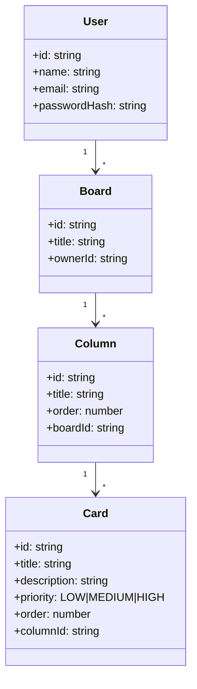

# Class Diagram

```mermaid
classDiagram
  class User {
    +id: string
    +name: string
    +email: string
    +passwordHash: string
  }

  class Board {
    +id: string
    +title: string
    +ownerId: string
  }

  class Column {
    +id: string
    +title: string
    +order: number
    +boardId: string
  }

  class Card {
    +id: string
    +title: string
    +description: string
    +priority: LOW|MEDIUM|HIGH
    +order: number
    +columnId: string
  }

  User "1" --> "*" Board
  Board "1" --> "*" Column
  Column "1" --> "*" Card
```
