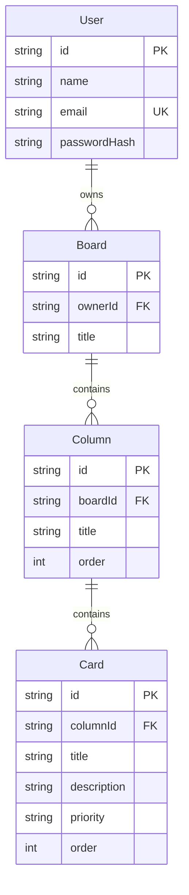

# ERD

```mermaid
erDiagram
  User ||--o{ Board : owns
  Board ||--o{ Column : contains
  Column ||--o{ Card : contains

  User {
    string id PK
    string name
    string email UK
    string passwordHash
  }

  Board {
    string id PK
    string ownerId FK
    string title
  }

  Column {
    string id PK
    string boardId FK
    string title
    int order
  }

  Card {
    string id PK
    string columnId FK
    string title
    string description
    string priority
    int order
  }
```
