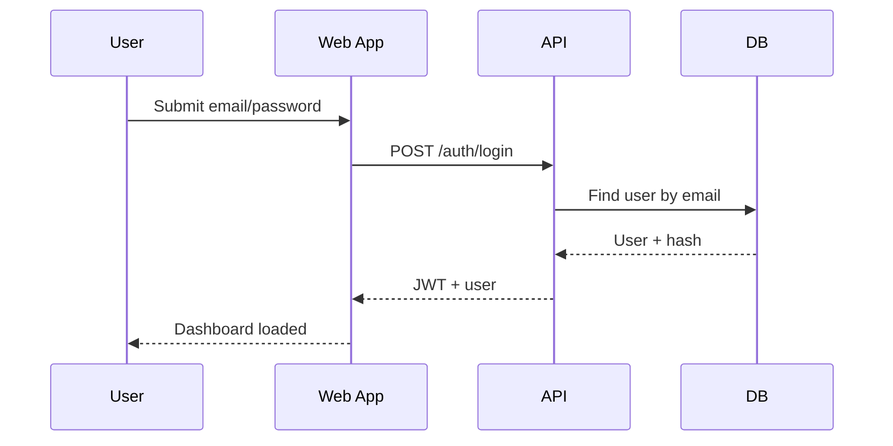
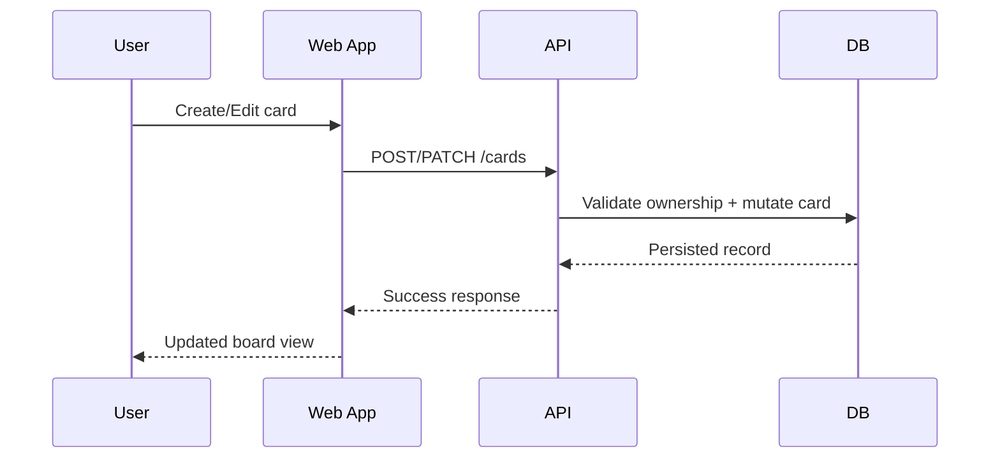
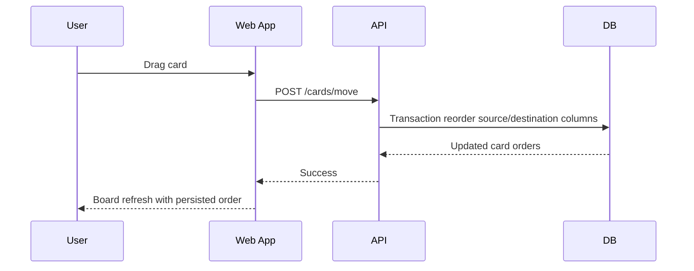

# Sequence Diagrams

## Login Flow

```mermaid
sequenceDiagram
  participant U as User
  participant W as Web App
  participant A as API
  participant D as DB
  U->>W: Submit email/password
  W->>A: POST /auth/login
  A->>D: Find user by email
  D-->>A: User + hash
  A-->>W: JWT + user
  W-->>U: Dashboard loaded
```

## Create/Update Card Flow

```mermaid
sequenceDiagram
  participant U as User
  participant W as Web App
  participant A as API
  participant D as DB
  U->>W: Create/Edit card
  W->>A: POST/PATCH /cards
  A->>D: Validate ownership + mutate card
  D-->>A: Persisted record
  A-->>W: Success response
  W-->>U: Updated board view
```

## Card Move Flow

```mermaid
sequenceDiagram
  participant U as User
  participant W as Web App
  participant A as API
  participant D as DB
  U->>W: Drag card
  W->>A: POST /cards/move
  A->>D: Transaction reorder source/destination columns
  D-->>A: Updated card orders
  A-->>W: Success
  W-->>U: Board refresh with persisted order
```
